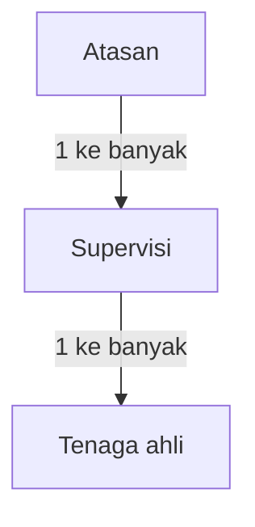

# ADR-0031: Hierarki atasan, supervisi, dan tenaga ahli

- Status: diterima.
- Tanggal: 2026-09-05.
- Stage: 0 untuk keputusan; 1/2 untuk data dan akses; 6 untuk rekap.
- Menggantikan: [ADR-0029](0029-atasan-langsung.md).
- Melengkapi: [ADR-0004](0004-hak-akses.md).

## Konteks

Pengguna mengoreksi hubungan sebelumnya: satu atasan membawahi banyak supervisi, dan satu supervisi membawahi banyak tenaga ahli. Tenaga ahli tidak dihubungkan langsung ke atasan dengan melewati supervisi.

## Keputusan

Cakupan tim atasan mengikuti tenaga ahli melalui supervisi di bawahnya. Keanggotaan project tetap mengatur project tempat tenaga ahli boleh mencatat pekerjaan; hierarki ini tidak menjadikan task memiliki pemilik permanen.

Pengguna memastikan supervisi adalah user yang dapat login dan melihat laporan tenaga ahli di bawahnya. Supervisi bukan sekadar kelompok administratif.

## Konsekuensi

- Usulan kolom atasan langsung pada tenaga ahli dari ADR-0029 tidak boleh diterapkan sebagai relasi aktif.
- Hierarki yang diperlukan hanya dua hubungan ini; jangan membuat engine hierarki organisasi tanpa batas.
- Akses API, filter rekap, detail laporan, dan attachment harus konsisten dengan cakupan hierarki. Jangan membuka laporan di bawah atasan lain atau seluruh anggota project hanya karena project sama.
- Supervisi dapat login dan membaca laporan serta attachment tenaga ahli di bawahnya. Ia tidak otomatis melihat tenaga ahli pada supervisi lain, termasuk yang berada di bawah atasan sama.
- Skema fisik masih usulan. Rangkap peran telah diputuskan pada [ADR-0033](0033-rangkap-peran.md); batas admin dan akses histori berdasarkan hubungan aktif pada [ADR-0034](0034-akses-histori.md). Provisioning dan validasi struktur dirinci saat Stage 1/2.

## Kasus penerimaan

Atasan A memiliki supervisi S1 dan S2; atasan B memiliki supervisi S3. Tenaga ahli T1 di S1 dan T2 di S2 berada dalam cakupan atasan A. Tenaga ahli T3 di S3 tidak boleh terlihat oleh atasan A meskipun bekerja pada project yang sama.
